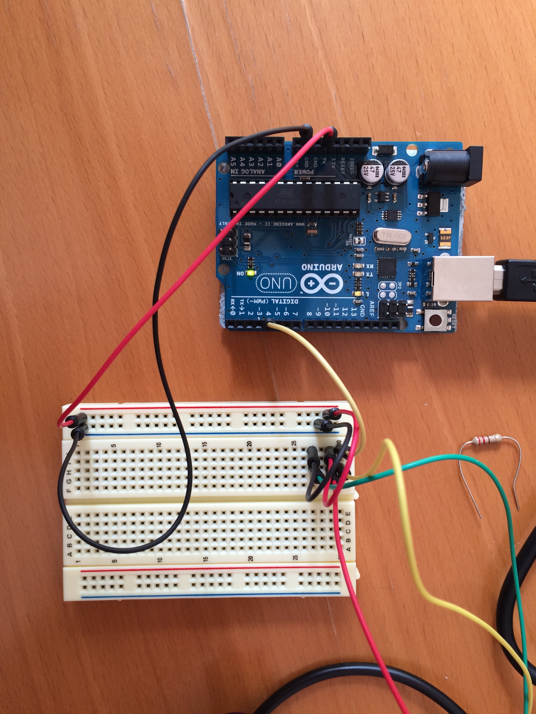
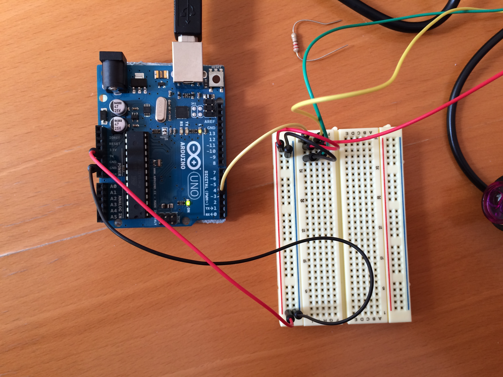
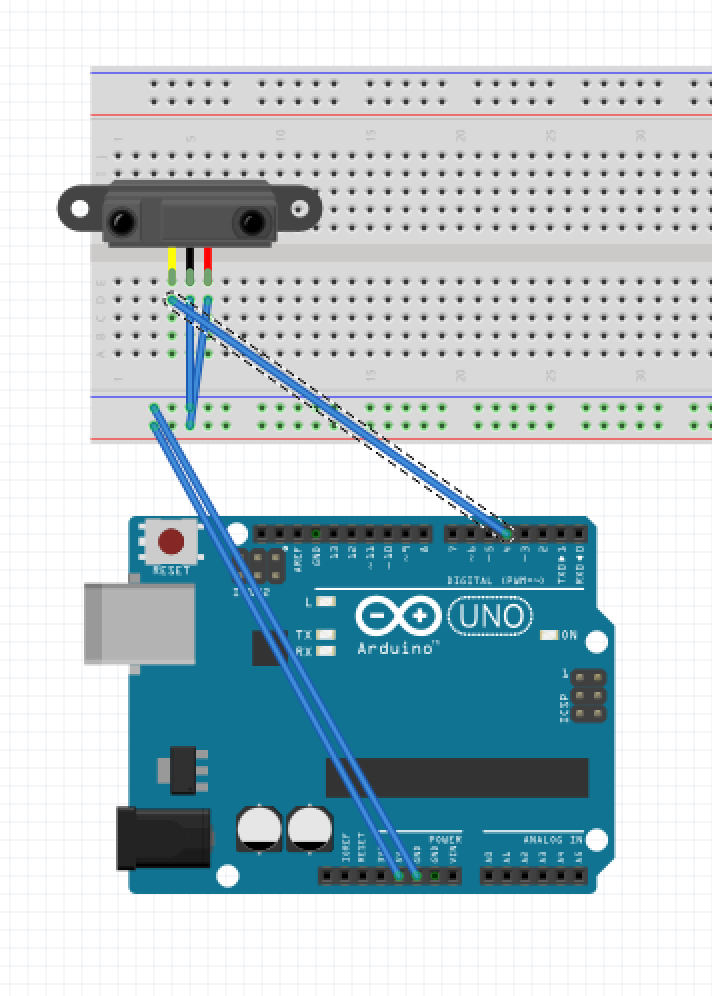
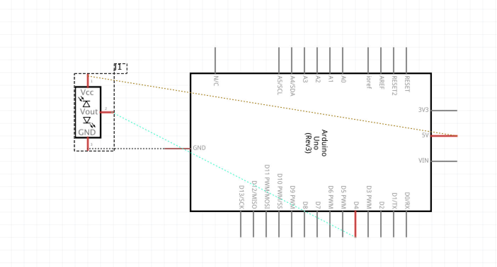

# Iteratie 1: Input
Belangrijk om aan de slag te kunnen, is het vinden van de juiste meetapparatuur. Ik was al bekend met verschillende sensoren en bij het uitdenken van een mogelijke oplossing, leek mij de IR-sensor veruit het beste. Het deeg moet namelijk een bepaalde grootte bereiken, dus een bepaalde hoogte in de kom behalen. Als ik deze sensor op de juiste hoogte bevestig, zal ik dan ook een redelijk accuraat resultaat terugkrijgen.

Daarom ben ik begonnen met het aansluiten van de Infrarood-sensor. IR-sensors zijn er in twee verschillende soorten; Analoog of Digitaal. Kort door de bocht; analoog meet een afstand, digitaal meet aan of uit. Voor mijn concept heb ik een digitale meting nodig.

De [code is in zijn geheel bijgevoegd](code/infrarood.ino).
Om visuele feedback terug te geven, gebruik ik een Serial.println en de ingebouwde LED van de Arduino.

