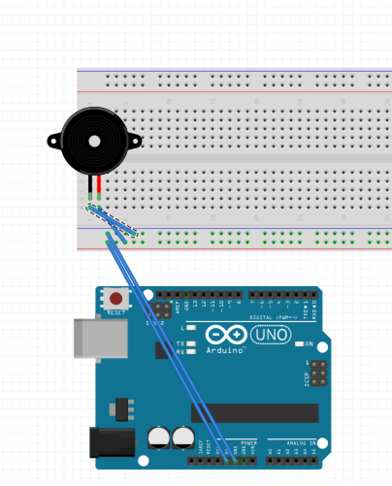

# Iteratie 2: Output - Piezo
Een kookwekker maakt kabaal, dus ook dit alarm moet feedback geven aan de kok op een duidelijke manier. Hiervoor heb je dus een speaker nodig. Een piezo is zo'n speaker. Erg simpel, maar heel handig. Een Piezo kan tonen produceren, maar ook trilling detecteren, afhankelijk van je code.

Hiervoor gebruik ik de Tone functie. De Arduino genereert een toon met een bepaalde frequentie en een duur. De frequentie is in Hertz. Er zijn libraries voor om dit om te zetten naar noten, zoals wij dat kennen in ons tonale systeem. De duur gaat in miliseconden, dus 1000. Dat is erg anders dan de ritmiek die in de muziek gehanteerd wordt. Daarom is een kleine rekensom nodig om dit om te zetten. Alle noten (kwart- of achtste noten) zijn relatief aan elkaar. Een kwart noot is bijvoorbeeld 1000ms/4, terwijl een achtste noot 1000ms/8 is.

Een simpele for-loop is nodig om de tonen één voor één af te spelen. De tonen van de melodie worden opgeslagen in een array, waarover gelooped wordt. Tegelijkertijd wordt de toonduur bepaald door een tweede array.
Er is een kleine pauze tussen de tonen nodig om de melodie niet te machinaal te laten klinken. Deze wordt uitgerekend op basis van de lengte van de toon, in dezelfde for-loop.

De [code](code/piezo.ino) is bijgevoegd.

