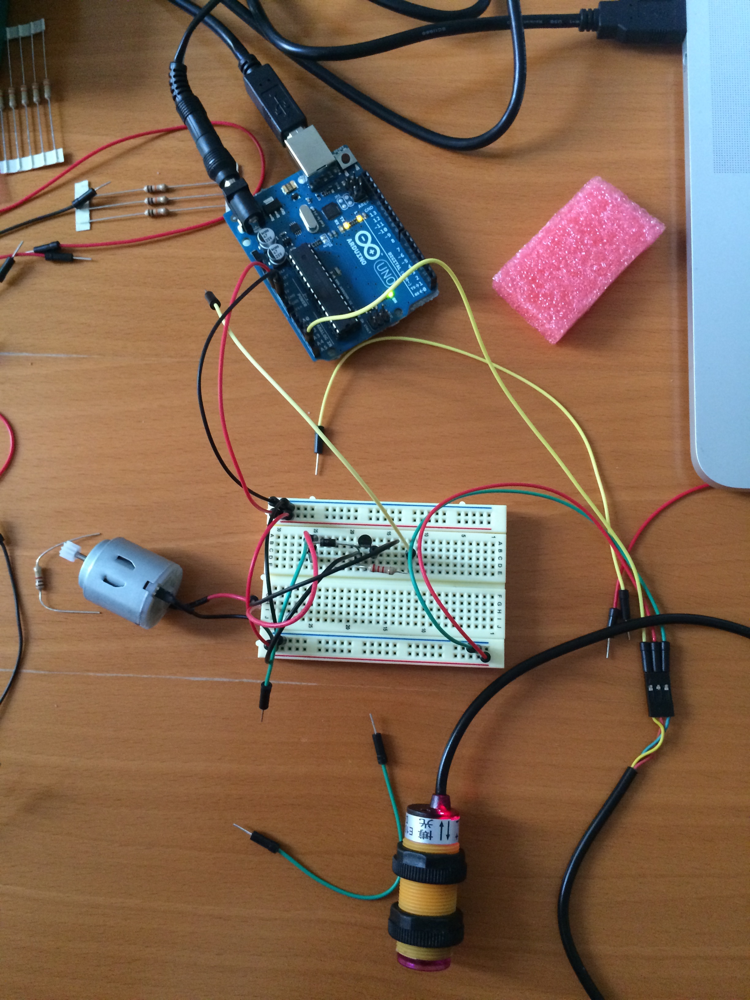
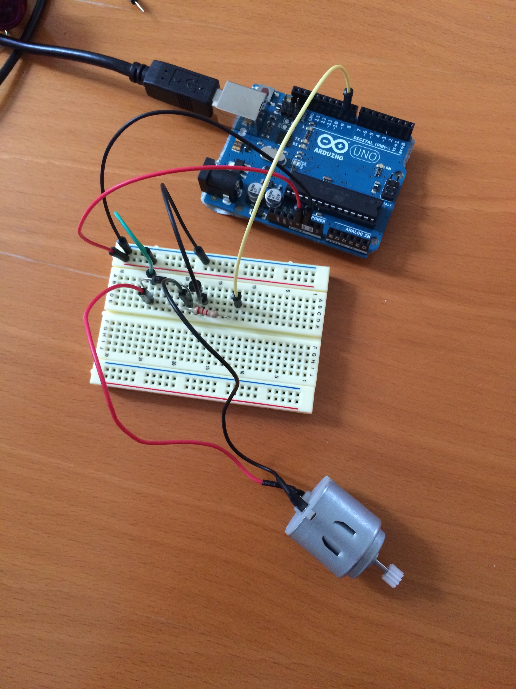
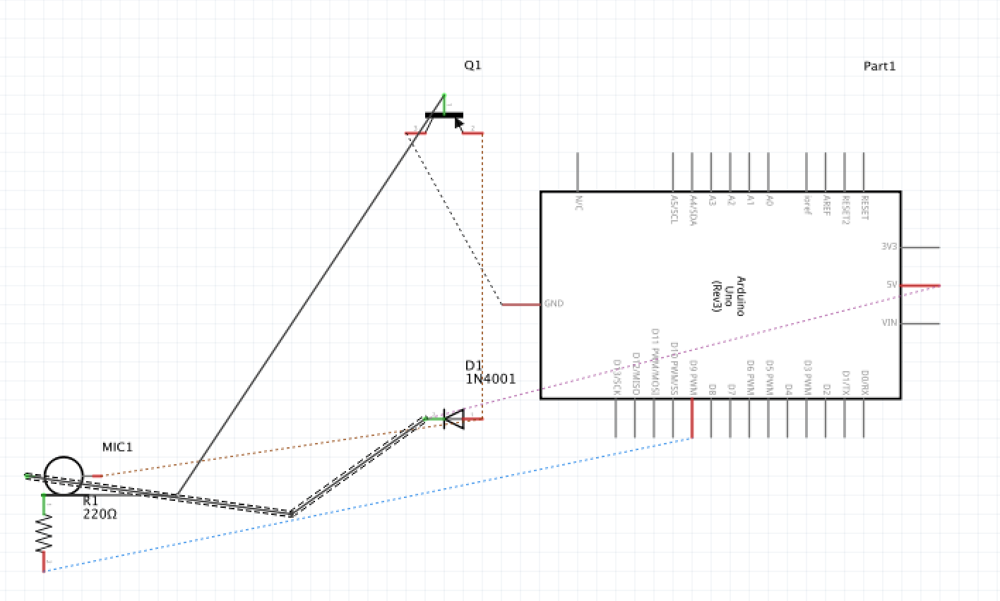
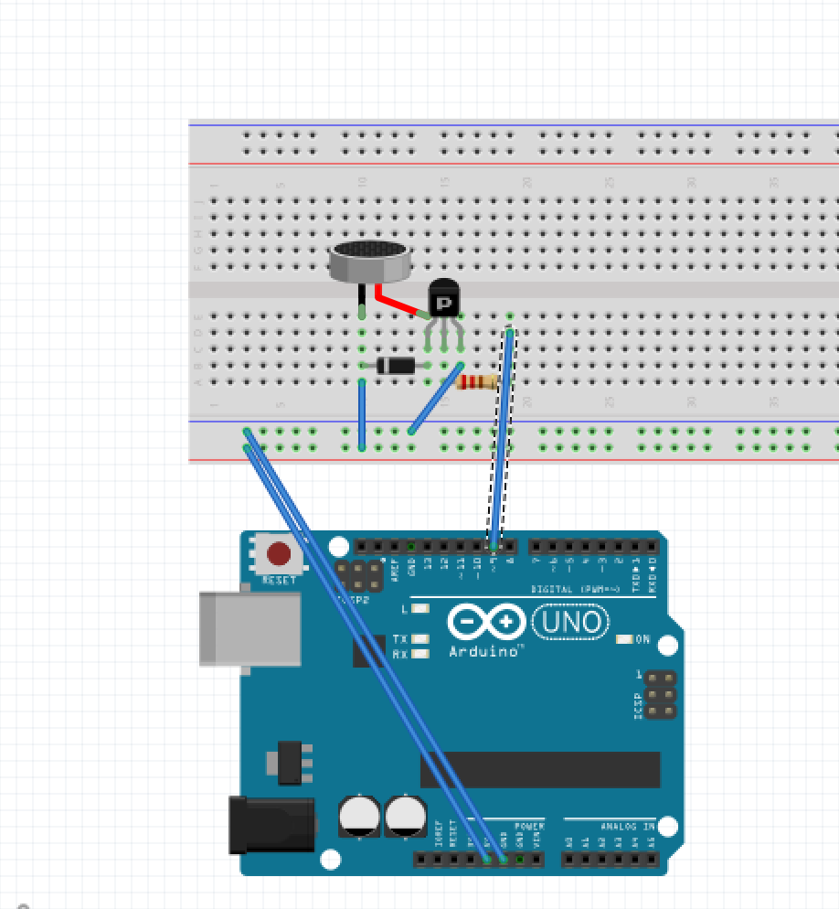

# Iteratie 3: Output - Motor
Onderdeel van het concept is om de theekdoek van de kom te verwijderen. Om dit te prototypen gebruik ik de DC Motor van mijn starterskit. Na wat inlezen blijkt werken met een motor niet simpel of zonder risico. Als ik de motor verkeerd aansluit zou hij mijn USB-poort kunnen verpesten.

Om de motor draaiende te krijgen, stuur ik 5V vanuit de Arduino naar mijn motor, maar daar tussen plaats ik een transistor. Een motor kan namelijk 'reverse current' ontwikkelen, door het momentum van het draaien. Deze energie moet weg uit de motor, maar je wilt dit graag controleren. Daarom plaats ik een transistor en een diode.

Dit was wat puzzel-werk. De transistor heeft drie pinnetjes en moeten goed gemonteerd worden, anders kan het een averechts effect hebben. Zodra alles in orde was op het breadboard, ging het besturen van de motor vrij soepel.

De [code](motor.ino) is bijgevoegd.

