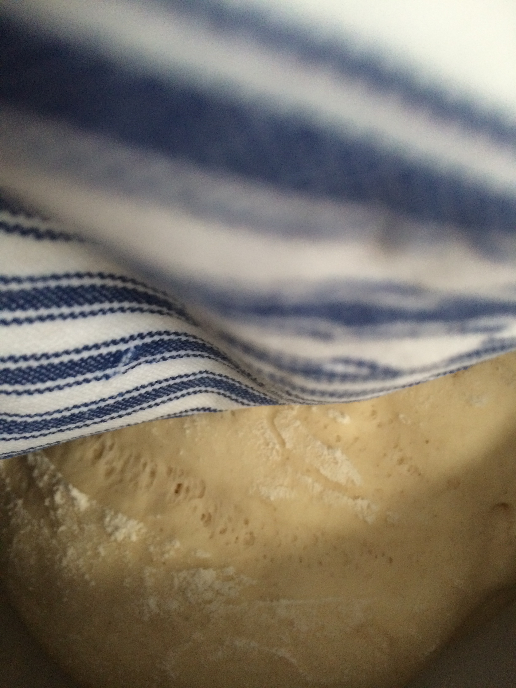
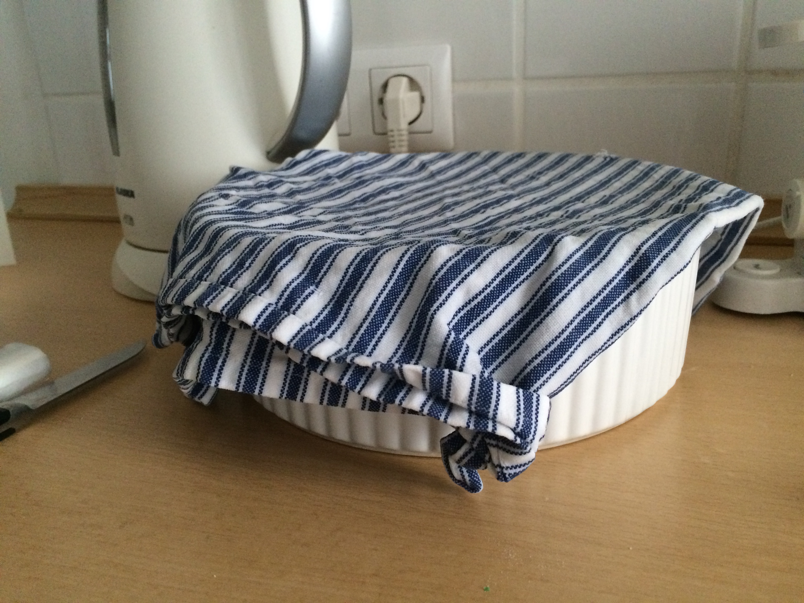
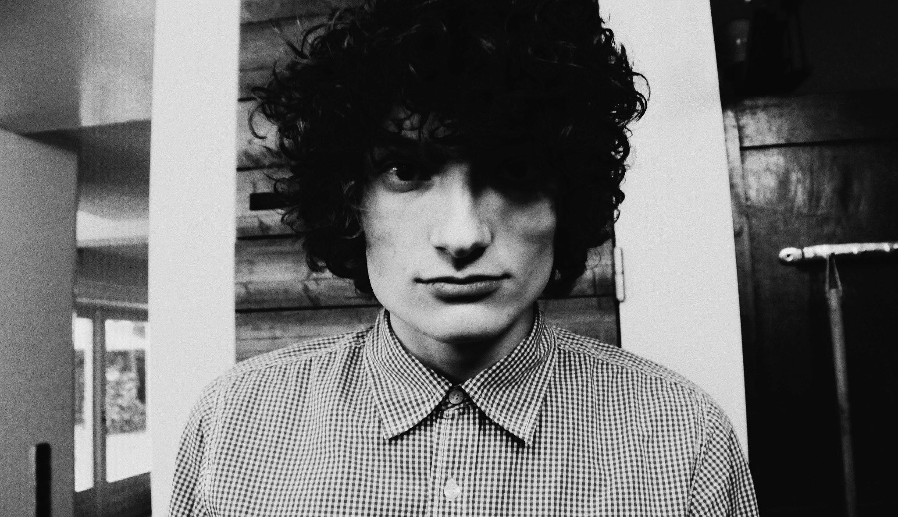

# Iteratie 8: User testing

Deze iteratie heb ik mijn prototype voorgelegd aan Daan. Daan is 24 en heeft 3 jaar in de keuken gewerkt van een Italiaans restaurant in Amsterdam; Panini. De IR-sensor moest een paar keer afgevuurd worden, om een goed gevoel te krijgen voor de werking van het prototype. Daan had niet veel omkijken naar het prototype, het functioneerde vrij soepel. Toch had hij enkele suggesties;

- Trekt de motor niet de rest van de spullen op mijn aanrecht omver?
- Als ik niet in de keuken hoef te zijn, zit ik ergens anders. Een notificatie op mijn telefoon zou handig zijn?
- Alles voelt heel kwetsbaar. Als ik werk met deeg, moet dat wel met enige kracht kunnen. 
- Als filmliefhebber kan ik het thema van de Godfather erg waarderen.

## Daan Dagevos
- 24 jaar
- Freelance Designer
- 3 jaar ervaring in Italiaanse keuken

## Aanbevelingen
Als we door de beperkingen van een prototype heenkijken, lost dit concept daadwerkelijk een probleem op. Het grote probleem van het concept is echter de plek die het inneemt. In zijn huidige vorm is het niet gemakkelijk in te passen in een volle keuken en erg fragiel. Het resultaat vanuit de user test is nuttig; er kan nog beter naar de situatie van de gebruiker gekeken worden. Waar begeeft de kok zich als hij of zij een uur moet wachten tot er weer verder gekookt kan worden? Wellicht is dan een notificatie, tweet of e-mail veel handiger dan een fysiek alarm.

In een volgend increment zou ik hier dus naar kijken. Verder zou ik ook kijken naar de uitstraling van het product. Het _italiaanse_ is nu erg een gimmick, terwijl dit ook de sterkte zou kunnen worden van het product.

Voor mij persoonlijk was het erg nuttig om met de Arduino bezig te zijn. Het was een eerste, maar zeer leerzame keer. Nu tijdens mijn afstuderen merk ik meer en meer het belang van prototyping. Ik creeër meer prototypes dan 'afgeronde' designs. Een prototype maakt je idee nog veel tastbaarder en maakt itereren vele malen gemakkelijker, terwijl dit met relatief weinig moeite in elkaar gezet kan worden.
